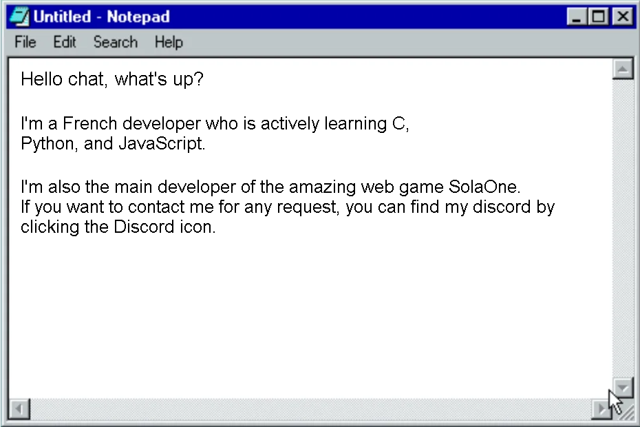

<!-- "Hero" Header -->

  

 

   
  &nbsp;&nbsp;&nbsp;&nbsp; 
   

 

  &nbsp;&nbsp;&nbsp;&nbsp;&nbsp; 
  Popular repositories

  &nbsp;&nbsp;&nbsp;&nbsp;&nbsp;&nbsp;&nbsp;&nbsp;&nbsp;&nbsp;&nbsp;&nbsp; 
   
  &nbsp;&nbsp;&nbsp;&nbsp; 
  

 
<!-- Footer -->

  
   
  
  &nbsp;&nbsp;&nbsp;&nbsp;  
  
  &nbsp;&nbsp;&nbsp;&nbsp;  
  
  &nbsp;&nbsp;&nbsp;&nbsp;  
  
  &nbsp;&nbsp;&nbsp;&nbsp;  
  

