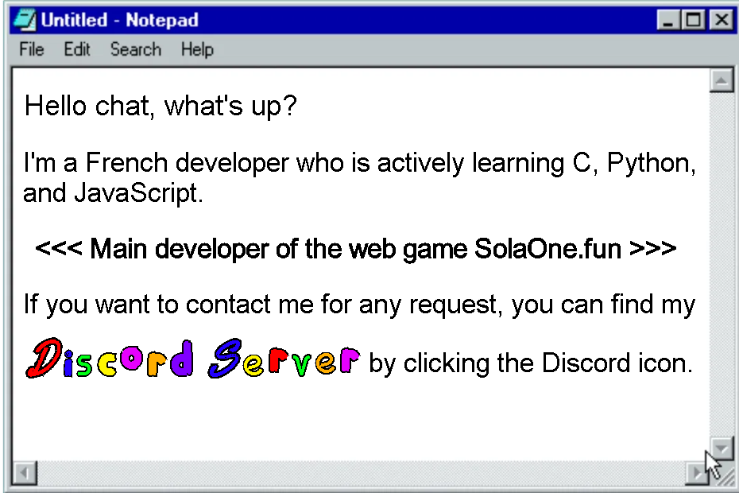

<!-- "Hero" Header -->

  

 

  &nbsp; 
  <a href="https://en.wikipedia.org/wiki/Microsoft_Paint"><a/>
  &nbsp;&nbsp;&nbsp;&nbsp;&nbsp; 
  <a href="https://discord.gg/GDFEXnQ9bU"><a/>

 

  &nbsp;&nbsp;&nbsp;&nbsp;&nbsp; 
  Popular repositories

 

  <a href="https://github.com/ajwentcrazy/SolaOne.fun"><a/>
  &nbsp;
  <a href="https://github.com/ajwentcrazy/Fake-Discord-Statue"><a/>

 
<!-- Footer -->

  
   
  <a href="https://discord.gg/GDFEXnQ9bU"><a/>
  &nbsp;&nbsp;&nbsp;&nbsp;  
  <a href="https://open.spotify.com/"><a/>
  &nbsp;&nbsp;&nbsp;&nbsp;  
  <a href="https://ubuntu.com/download"><a/>
  &nbsp;&nbsp;&nbsp;&nbsp;  
  <a href="http://twitch.tv/"><a/>
  &nbsp;&nbsp;&nbsp;&nbsp;  
  <a href="https://store.steampowered.com/"><a/>

